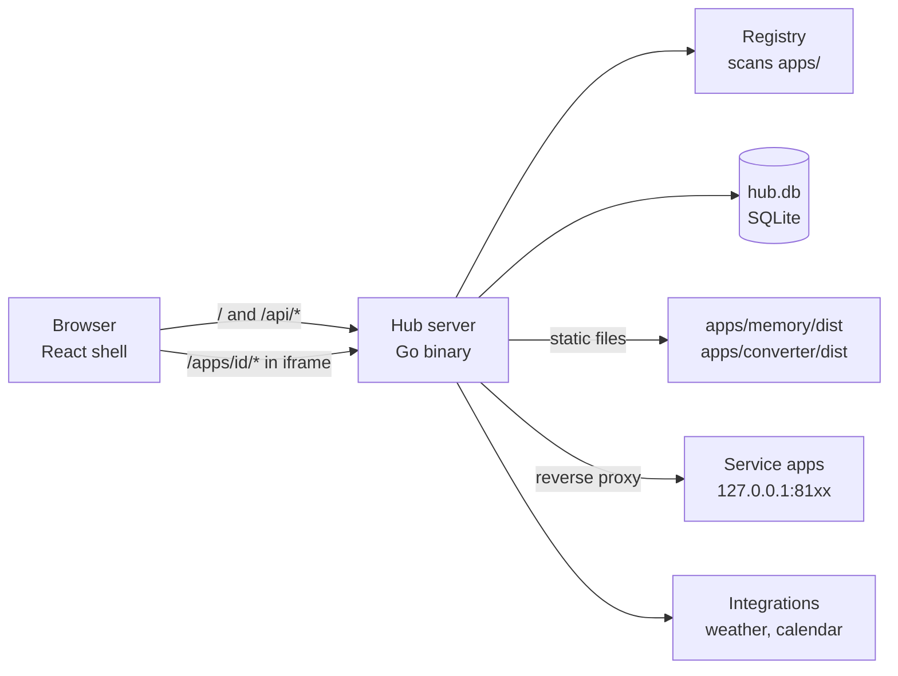

# Hub — System Design

Sep 24, 2026 · @Hope Idowu

## Overview

Hub is a personal app store: one web frontend that launches all apps, tools and mini games, where a new app plugs in by dropping a folder with a manifest into `apps/`. Apps can be written in any language. Hub itself is a Go backend with a React + TypeScript frontend and a SQLite file for state.

**Goals**

- One place to open every app, desktop-first, usable on a phone.
- Add an app without changing Hub's code: folder + manifest, then it shows up.
- Any language: static web apps and small servers both work.
- A home screen with recently used apps, categories built from the apps themselves, and a status strip (time, weather, next calendar event, app health).
- Simple enough for one developer to build and run.

**Non-goals for v1**

- Third-party apps or a marketplace. Every app is trusted, first-party code.
- Personal-management modules (tasks, notes, finance). Those would just be apps if ever built.
- Multiple users or roles.
- The AI agent. The manifest leaves room for it (see Later), but nothing is built for it in v1.

Visual reference: the mockups in `instructions/mockups/` (Home desktop, Home mobile, Football settings).

## Architecture at a glance

Everything goes through one Go binary. It serves the React app, serves static apps from disk, forwards traffic to service apps, and owns the SQLite file. Service apps are separate processes on localhost that only Hub talks to.



Three request paths cover almost everything:

1. **Load the home screen.** `GET /` returns the React build. The shell then calls `GET /api/apps`, `GET /api/recent` and `GET /api/status`.
2. **Open a static app.** The shell navigates to `/open/{id}` and renders an iframe pointing at `/apps/{id}/`. Hub serves that app's files from its folder.
3. **Open a service app.** Same iframe, but Hub reverse-proxies `/apps/{id}/*` to the app's `upstream` address, stripping the `/apps/{id}` prefix.

The frontend never talks to an app's port directly, so auth, logging and routing live in one place.

## The app contract

An app is a folder under `apps/` containing a `hub.json` manifest and an icon. That is the whole integration: Hub never imports app code, it only reads the manifest.

```
apps/
  memory/
    hub.json
    icon.svg
    dist/            # built static files (index.html at the root)
  football/
    hub.json
    icon.svg         # the server itself runs elsewhere, any language
```

Example manifests:

```json
{
  "manifestVersion": 1,
  "id": "memory",
  "name": "Memory",
  "description": "Match the pairs",
  "category": "Games",
  "tags": ["puzzle"],
  "icon": "icon.svg",
  "type": "static",
  "entry": "dist"
}
```

```json
{
  "manifestVersion": 1,
  "id": "football",
  "name": "Football",
  "description": "Live scores, fixtures and tables",
  "category": "Info",
  "icon": "icon.svg",
  "type": "service",
  "upstream": "http://127.0.0.1:8101",
  "health": "/health"
}
```

| Field | Required | Meaning |
| --- | --- | --- |
| `manifestVersion` | yes | Always `1` for now; lets the format change later without breaking old apps |
| `id` | yes | Unique, lowercase `a-z0-9-`, matches the folder name; used in URLs and the database |
| `name` | yes | Display name, 20 characters or fewer so it fits under an icon |
| `description` | no | One line for search results and the app page |
| `category` | yes | Any string; Hub builds the category list from these |
| `tags` | no | Extra search terms and secondary categories |
| `icon` | yes | Path inside the folder; SVG preferred, PNG 256×256 accepted |
| `type` | yes | `static` or `service` |
| `entry` | static only | Folder containing `index.html` |
| `upstream` | service only | Base URL of the app's server, localhost only |
| `health` | no | Path Hub polls; default `/health` for service apps |

**Validation.** Hub validates every manifest at scan time. An invalid one is skipped, logged with the reason, and listed in Settings so it never breaks the home screen. Unknown fields are ignored, which is how `widget` and `actions` can be added later without a version bump.

**Rules every app follows**

- Works under a sub-path (`/apps/{id}/`): relative asset URLs only. In Vite that means `base: './'`.
- Works inside an iframe: no reliance on being the top window.
- Service apps bind to `127.0.0.1`, never `0.0.0.0`, so nothing can reach them except through Hub.

## App types

Pick `static` whenever an app can run entirely in the browser; use `service` only when it needs a server (external APIs with secrets, heavy processing, scheduled work).

|  | Static app | Service app |
| --- | --- | --- |
| What it is | Built HTML/JS/CSS files | Its own HTTP server, any language |
| Examples | Memory, Reaction, Puzzle, Converter, Meal picker, Random | Football, Transcribe, Documents |
| Who serves it | Hub, from `apps/{id}/{entry}` | The app; Hub reverse-proxies to `upstream` |
| Who starts it | Nobody, it's files | You (v1), via NSSM, Docker or a script |
| Health | Always up if the files exist | Hub polls `health` every 30 s |
| State | Browser storage, keys prefixed with the app id | Its own storage, e.g. its own SQLite file |

**Static apps.** Hub serves the folder with correct content types and a fallback to `index.html` for apps with client-side routing. All apps share Hub's origin, so browser storage is shared too: every app prefixes its `localStorage` keys with its id (`memory:bestTime`). A small Hub key-value API can replace this later (see Open decisions).

**Service apps.** Hub forwards `/apps/{id}/anything` to `{upstream}/anything` and sets `X-Forwarded-Prefix: /apps/{id}`, so the app can build correct links. WebSockets pass through, because Go's reverse proxy handles connection upgrades. Each service app must:

- Answer `GET /health` with `200` within 3 seconds when it's working.
- Keep long work (a 20-minute transcription) off the request: accept the job, return a job id, let the UI poll for progress.
- Keep its own secrets (API keys) in its own environment, never in `hub.json`.

**Games.** Memory, Reaction and Puzzle share a game kit (`appkit/game-kit.js`, copied into each game by `appkit/sync.py`): a home screen with Continue, New game, difficulty and stats, and settings for sound effects, music, volume and game options. Each game saves the game in progress in its own keys (`memory:progress`, `reaction:round`, `puzzle:save`). Hub opens a game at `#continue` or `#new`: `/open/{id}#continue` passes the hash to the iframe, which is how Home's Resume button reopens a Memory game where it was left.

**Documents** (`apps/documents`, Python, :8103) is an all-in-one PDF tool in the spirit of iLovePDF: merge, split, remove and reorder pages, rotate, compress, page numbers, watermarks, passwords; convert images ↔ PDF, Word/Excel/PowerPoint → PDF (LibreOffice), PDF → Word (pdf2docx) and text; and a page editor for text, whiteout, highlight, drawing, images, signatures and true redaction (PyMuPDF). Files are processed on the Hub machine and deleted after two hours.

## Hub backend (Go)

One binary built mostly on the standard library: `net/http` routing (Go 1.22+ path patterns), `net/http/httputil.ReverseProxy`, `embed` to bundle the React build, and `log/slog` for logs. The only planned outside dependency is a pure-Go SQLite driver (`modernc.org/sqlite`), chosen so the build needs no C compiler on Windows.

**Layout**

```
cmd/hub/main.go          # load config, wire everything, start server
internal/config          # env vars and hub.yaml
internal/registry        # scan apps/, parse + validate hub.json, hold the app list
internal/proxy           # one ReverseProxy per service app
internal/health          # poll service apps, keep latest status
internal/integrations    # weather, calendar providers
internal/store           # SQLite access + migrations
internal/auth            # password check, sessions, middleware
internal/api             # JSON handlers
internal/spa             # serves the embedded React build with index.html fallback
internal/logging         # slog JSON to stdout + size-rotated data/hub.log
internal/maint           # daily pruning and database backups
web/                     # React app; its build is embedded
appkit/                  # theme snippet static apps copy into their <head>
```

**Registry.** Scans `apps/` at startup and on `POST /api/registry/rescan`. It keeps the parsed apps in memory behind a `sync.RWMutex`; the database stores only user state (installed, pinned, opens). File watching can come later; a rescan button is enough for v1.

**Health checker.** One goroutine ticks every 30 seconds and checks all service apps in parallel with a 3-second timeout each. The latest result per app lives in memory for the API; each result is also written to `health_checks` for history.

**HTTP API**

| Method + path | Purpose |
| --- | --- |
| `GET /api/apps` | All valid apps with install state and current health |
| `GET /api/apps/{id}` | One app's details |
| `POST /api/apps/{id}/install` | Show the app on the home screen |
| `DELETE /api/apps/{id}/install` | Hide it (files stay on disk) |
| `POST /api/apps/{id}/pin` · `DELETE …/pin` | Favorites |
| `POST /api/apps/{id}/opened` | Record an open, feeds Recently used |
| `POST /api/apps/{id}/check` | Run a service app's health check now (the offline screen's Retry) |
| `GET /api/recent?limit=6` | Most recently opened installed apps |
| `GET /api/categories` | Categories with app counts, in display order |
| `GET /api/status` | Status strip data: weather, next event, health summary |
| `POST /api/registry/rescan` | Re-read `apps/` |
| `GET /api/registry/errors` | Manifests that failed validation, with reasons |
| `GET /healthz` | Hub's own health, no auth |
| `GET /api/settings` | Weather location, category order, whether the calendar and login are configured |
| `PUT /api/settings/weather` · `DELETE …` | Set or clear the weather location and units |
| `PUT /api/settings/category-order` | Sidebar category order |
| `GET /api/geocode?q=` | Place search for the weather location (Hub calls out, the browser never does) |
| `GET /api/session` | Whether a password is required and whether this browser is signed in |
| `POST /api/login` · `POST /api/logout` | Session auth |

**Non-API routes**

- `/apps/{id}/*` → static file server or reverse proxy, by the app's `type`. Unknown or uninstalled id → 404.
- Everything else → the embedded React build, falling back to `index.html` so client-side routes work on refresh.

Errors return JSON `{"error": "message"}` with a proper status code. Every request is logged with method, path, status and duration.

## Frontend (React + TypeScript)

A Vite single-page app: React Router for pages, TanStack Query for everything fetched from `/api` (caching, refetch, loading states), and plain CSS with the mockups' colours and fonts as CSS variables (`web/src/index.css`), light and dark. Fonts (Bricolage Grotesque, Instrument Sans) are bundled, so Hub looks right offline. In development, Vite runs on its own port and proxies `/api` and `/apps/` to the Go server on `:8080`.

**Screens**

| Route | Screen | What's on it |
| --- | --- | --- |
| `/` | Home | Status line (date, time, weather, next event, app health), greeting, search box, Today rows (football carousel, tonight's meal, Memory progress), Your apps grid with category filters |
| `/c/{category}` | Category | Icon grid of that category's installed apps |
| `/apps` | All apps | Every installed app with Pin and Hide, plus a Not installed section with Install buttons |
| `/favorites` · `/recent` | Favorites, Recent | Pinned apps; the last dozen launches |
| `/open/{id}` | App view | Slim top bar (menu, home, icon, name, app switcher, pop-out) and the app in an iframe |
| `/settings` | Settings | Theme, widgets, apps folder rescan, manifest errors, category order, sign out |
| `/settings/football` | Football | Leagues, clubs, what shows when nothing is live, carousel length |
| `/settings/status` | Weather and calendar | Weather location and units, calendar status, app health with Check now |

**Layout.** A fixed left sidebar (logo, Home, All apps, Favorites, Recent, categories with counts, Settings, profile and theme toggle) and a scrolling main area on warm paper. Under 900 px the sidebar becomes a drawer behind a top bar; under 640 px Home switches to the mobile mockup's compact layout.

**Launcher.** Home's search box (focus with `/`) and the Ctrl+K palette (from anywhere, including over an open app) share one command list: fuzzy search over app names, descriptions and tags, plus actions (reroll the meal, switch theme, rescan, open settings). ↑/↓ select, Enter runs.

**Opening an app.** Click → `POST /api/apps/{id}/opened` (fire and forget) → navigate to `/open/{id}` → iframe `src="/apps/{id}/"`. Pop-out opens the same URL in a new browser tab for full-screen use. If the app is a service app and its last health check failed, the app view shows an "offline, retry" state instead of a broken iframe.

**Main components:** `Sidebar`, `HomeSearch`, `StatusItems`, `FootballRow`, `MealRow`, `MemoryRow`, `AppTile` (with health dot), `CommandPalette`, `OpenApp`, `Login`.

**Design tokens** from the mockups: display font Bricolage Grotesque, body font Instrument Sans; light `--paper #EEE9DF`, `--surface #F8F5EF`, `--ink #1C1A16`, `--muted #625B4F`, `--line #D9D1C2`, `--dash #B8AE9C`, `--live #1E7A48`, focus `#3552E0`; dark `--paper #17150F`, `--surface #221F18`, `--ink #F2EDE3`, `--muted #A69E8F`, `--line #35302A`. Rows are separated by hairlines rather than boxed in cards; buttons are pills; app icons are multi-colour SVGs on a 64 px grid with 16 px corners, supplied by each app. Static apps copy `appkit/theme-head.html` to share the tokens and follow Hub's light/dark choice.

## Data model (SQLite)

The `apps/` folder is the source of truth for what apps exist; `hub.db` stores only user state, keyed by app id. Delete an app's folder and its rows are simply ignored, never an error.

```sql
CREATE TABLE app_state (
  app_id       TEXT PRIMARY KEY,
  installed    INTEGER NOT NULL DEFAULT 0,   -- shown on home screen
  pinned       INTEGER NOT NULL DEFAULT 0,   -- favorites
  installed_at TEXT                          -- ISO 8601 UTC
);

CREATE TABLE app_opens (
  id        INTEGER PRIMARY KEY,
  app_id    TEXT NOT NULL,
  opened_at TEXT NOT NULL
);
CREATE INDEX app_opens_app_time ON app_opens (app_id, opened_at);

CREATE TABLE health_checks (
  app_id     TEXT NOT NULL,
  checked_at TEXT NOT NULL,
  ok         INTEGER NOT NULL,
  status     INTEGER,        -- HTTP status, NULL on timeout
  latency_ms INTEGER,
  error      TEXT
);

CREATE TABLE settings (
  key   TEXT PRIMARY KEY,
  value TEXT NOT NULL        -- JSON
);

CREATE TABLE sessions (
  token_hash TEXT PRIMARY KEY,
  created_at TEXT NOT NULL,
  expires_at TEXT NOT NULL
);
```

| Table | Written by | Read by | Retention |
| --- | --- | --- | --- |
| `app_state` | Install, hide, pin endpoints | `/api/apps`, `/api/recent`, sidebar | Forever |
| `app_opens` | `POST /api/apps/{id}/opened` | `/api/recent` (latest open per app, top 6) | 90 days, pruned daily |
| `health_checks` | Health checker | Settings history, uptime later | 7 days |
| `settings` | Settings screen | Integrations, category order | Forever |
| `sessions` | Login | Auth middleware | Until expiry |

**Migrations.** Numbered `.sql` files embedded in the binary (`001_init.sql`, `002_…`), applied in order at startup, with the current number kept in a `schema_version` table. Enable WAL mode on open so the health checker's writes don't block API reads.

## Status strip integrations

Each integration is a small provider the backend refreshes on its own timer and caches in memory. `GET /api/status` returns whatever is cached, so the home screen never waits on an outside service, and a failing provider shows a dash instead of an error.

```go
type Provider interface {
    Name() string
    Interval() time.Duration
    Fetch(ctx context.Context) (any, error)
}
```

| Item | Source | Refresh | Notes |
| --- | --- | --- | --- |
| Time | Browser clock | Every minute, client-side | No backend work |
| Weather | Open-Meteo forecast API (free, no key, as far as I know; confirm current terms) | 15 min | Latitude and longitude stored in `settings` |
| Next event | The calendar's private iCal (ICS) link | 10 min | Parse events, return the next one within 24 h; the link is a secret, keep it in config |
| App health | Health checker | 30 s | "5 of 6 apps running", red dot if any are down |

Adding a new integration later (an exchange rate, a GitHub build status) means writing one more provider and one more pill in `StatusStrip`. The ICS route is chosen over the Google Calendar API because it needs no OAuth flow; switch if you ever want to create events from Hub.

## Security and auth

Hub starts out bound to `127.0.0.1`, reachable only from your own machine. The moment it listens on anything wider, login is on and cannot be turned off.

- **One user, one password.** The password's bcrypt hash lives in config (`HUB_PASSWORD_HASH`), never the plain password. A `hub hash-password` subcommand generates it.
- **Sessions.** Login sets a random 32-byte token in a cookie marked `HttpOnly`, `Secure` (when served over HTTPS) and `SameSite=Lax`, valid 30 days. Only the token's SHA-256 hash is stored in `sessions`.
- **What's protected.** Auth middleware wraps `/api/*` and `/apps/*`, so every service app inherits the login without implementing one. Only `/healthz`, `/api/login`, `/api/session` and the shell itself (which shows the login screen) are open. Hub never forwards its session cookie to service apps.
- **CSRF.** `SameSite=Lax` plus a required `X-Hub-Request: 1` header on every state-changing API call.
- **Login throttling.** After 5 failed attempts from one IP, wait 1 minute.
- **Trust model.** Apps share Hub's origin, so any app's JavaScript can call the Hub API. That's acceptable because every app is your own code; it's also why third-party apps are a non-goal.
- **Remote access.** Prefer a private network overlay (Tailscale, WireGuard) or a tunnel over opening a port on your router, and always serve over HTTPS once it leaves your machine.
- **Secrets.** ICS link, weather settings and app API keys go in environment variables or a git-ignored config file.

## Deployment, config and operations

The release artifact is one executable plus an `apps/` folder and a `data/` folder. Build order: `npm run build` in `web/`, then `go build ./cmd/hub`, which embeds the frontend. A Makefile (or `build.ps1` on Windows) runs both.

| Setting | Env var | Default |
| --- | --- | --- |
| Listen address | `HUB_ADDR` | `127.0.0.1:8080` |
| Apps folder | `HUB_APPS_DIR` | `./apps` |
| Data folder (hub.db, logs) | `HUB_DATA_DIR` | `./data` |
| Password hash | `HUB_PASSWORD_HASH` | none; required if not on localhost |
| Calendar ICS link | `HUB_CALENDAR_ICS` | none; strip hides the pill |
| Log level | `HUB_LOG_LEVEL` | `info` |
| TLS certificate and key | `HUB_TLS_CERT`, `HUB_TLS_KEY` | none; set both to serve HTTPS directly |
| Weather and place search APIs | `HUB_WEATHER_URL`, `HUB_GEOCODE_URL` | Open-Meteo; override only for testing |

**Running it.** On Windows, run the binary as a service with NSSM set to Automatic start, so Hub survives reboots without anyone logging in. On Linux, a systemd unit does the same. Docker Compose becomes the better option once there are several service apps: one file starts Hub and every service app together.

**Service apps in v1** are started the same way as Hub (their own NSSM service or a Compose entry). Hub only checks their health; it doesn't start or restart them.

**Logs.** `slog` writes JSON lines to stdout and `data/hub.log`, rotated at 10 MB with three old files kept, by a small built-in rotator (slog doesn't rotate on its own).

**Backups.** Hub copies `data/hub.db` daily with SQLite's `VACUUM INTO` (consistent while Hub runs) to `data/backups/hub-YYYYMMDD.db`, keeping the last seven. The same daily job prunes opens, health checks and expired sessions. The `apps/` folders should live in git.

## Build plan

Eight milestones, each ending in something you can open and use. Every milestone after M0 adds exactly one new kind of problem, so nothing is learned twice or all at once.

| # | Milestone | What gets built | Done when |
| --- | --- | --- | --- |
| M0 | Skeleton | Go server, config, `/healthz`, embedded placeholder page, SQLite + migrations | `hub.exe` runs and serves a page at `localhost:8080` |
| M1 | Registry + first static app | Manifest scan and validation, `/api/apps`, static serving at `/apps/{id}/`; Converter as app #1 | Dropping a folder into `apps/` and pressing rescan makes it appear in `/api/apps` and open in the browser |
| M2 | The shell | React app: sidebar, categories, All apps, app view with iframe, install and hide | Converter opens inside Hub from its icon; hiding it removes it from Home |
| M3 | Home + launcher | Recently used, Browse by category, Ctrl+K palette; Meal picker and Memory as apps #2 and #3 | Opening apps reorders Recently used; Ctrl+K → "mem" → Enter opens Memory |
| M4 | Service apps | Reverse proxy, health checker, health dots, offline state; Football as the first service app | Stopping Football's process turns its dot red within 30 s, and restarting it recovers without restarting Hub |
| M5 | Status strip | Provider framework, weather, calendar ICS, health summary | Strip shows real weather and your next event; killing the network shows dashes, not errors |
| M6 | Auth + remote access | Password login, sessions, middleware, HTTPS setup | From your phone, Hub asks for the password and then works fully |
| M7 | Transcribe | Python service app with upload, background job and progress polling | A 10-minute audio file transcribes while you use other apps |

The remaining games and tools (Reaction, Puzzle, Random, Names) can be added any time after M2, since they're just more static apps.

**Status (Sep 2026):** M0–M7 are built, along with Reaction, Puzzle, Random, Names, Documents and the game kit. Football uses ESPN's public scoreboard feed (no key); Transcribe uses faster-whisper locally.

## Later: widgets, quick actions, AI

All three hang off optional manifest fields, so existing apps keep working untouched.

**Widgets.** An app adds `"widget": {"path": "/widget", "size": "wide"}`. Home renders that path as another row in its Today list, like the football carousel and tonight's meal (which are built into the shell for now). Widgets refresh themselves; Hub just gives them a slot.

**Quick actions.** An app lists what it can do without being opened:

```json
"actions": [
  {"id": "reroll", "title": "Pick a meal", "method": "POST", "path": "/api/pick"},
  {"id": "convert", "title": "Convert units", "method": "POST", "path": "/api/convert",
   "input": {"value": "number", "from": "string", "to": "string"}}
]
```

Hub shows them in the right-click menu on an icon and in the Ctrl+K palette, and calls them through the same `/apps/{id}/` proxy. Static apps can't serve actions, so this is mostly for service apps.

**AI agent.** The actions list is already a tool list: names, descriptions, typed inputs. An agent service reads every app's actions from `/api/apps`, passes them to an LLM as tools, and executes the calls it chooses. Anything that changes data asks you to confirm first.

**Polish.** The app icon zooming into the app view (the browser View Transitions API does this cheaply), a per-app key-value API to replace prefixed `localStorage`, and file watching instead of manual rescan.

## Open decisions

Each has a v1 default, so none of them blocks starting.

| Question | v1 default | Revisit when |
| --- | --- | --- |
| Should Hub start and restart service apps itself? | No; NSSM or Compose runs them | Managing their processes by hand gets annoying |
| Manual rescan or watch `apps/` for changes? | Manual rescan button | Adding apps becomes frequent |
| Shared `localStorage` with prefixes, or a Hub key-value API? | Prefixes | A static app needs data on more than one device |
| Where does Hub live long-term: laptop or a small always-on server? | Laptop | Phone access matters when the laptop is off |
| Tailwind or CSS modules? | Decided: plain CSS with variables in one stylesheet | Styles get hard to read |
| Calendar via ICS link or Google Calendar API? | ICS link | You want to create or edit events from Hub |
